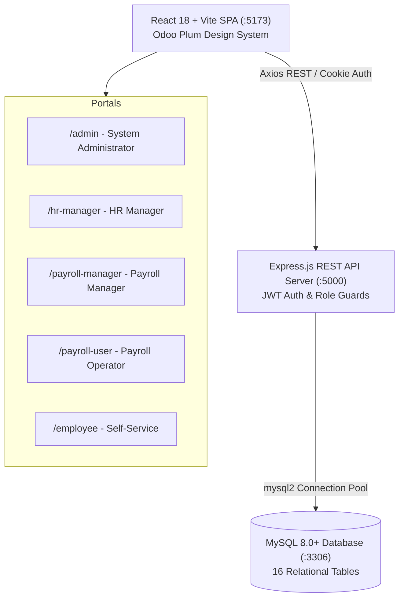

# 🚀 PeoplePay360 — Next-Gen HR & Payroll Management Platform

> An enterprise-grade, full-stack Human Resources and Automated Payroll platform inspired by Odoo's clean aesthetic, built with **React 18**, **Node.js (Express)**, and a **MySQL 8.0+** locked 16-table relational architecture.

[](https://github.com/jaypatel-tech116/PeoplePay360-HR-Payroll/actions)
[](LICENSE)
[](client/)
[](server/)
[](server/src/config/schema_mysql.sql)

---

## 📑 Table of Contents
- [Platform Highlights](#-platform-highlights)
- [System Architecture](#-system-architecture)
- [5 Stakeholder Portals](#-5-stakeholder-portals)
- [Default Login Credentials](#-default-login-credentials)
- [Database Schema (16 Tables)](#-database-schema-16-tables)
- [Quick Start Guide](#-quick-start-guide)
  - [Prerequisites](#prerequisites)
  - [Backend Setup](#1-backend-setup)
  - [Frontend Setup](#2-frontend-setup)
  - [Database Seeding (500 Employees)](#3-database-seeding)
- [Complete API Endpoints Map](#-complete-api-endpoints-map)
- [Project Directory Structure](#-project-directory-structure)
- [CI / CD Workflows](#-ci--cd-workflows)
- [License](#-license)

---

## ✨ Platform Highlights

- **5 Dedicated Stakeholder Portals**: Independent, role-secured portals for System Administrators, HR Managers, Payroll Managers, Payroll Operators, and Employees.
- **Automated Salary Rules Engine**: Computes basic wages, HRA, special allowances, statutory deductions (PF, PT, TDS) with mathematical precision and zero rounding discrepancies.
- **Payrun Batch Generation**: Lifecycle governance (`Draft` ➔ `Computed` ➔ `Approved` ➔ `Paid`) handling hundreds of employees simultaneously.
- **Live Attendance & Time Tracking**: Employee punch clock (Clock In / Clock Out) with real-time worked hours counters and manager regularization tools.
- **Leave Allocation & Quota Management**: Real-time quota validation, visual donut balance breakdown, and multi-tier HR approval workflows.
- **Live Multi-Table Database Synchronization**: Editing employee profile or contract details updates `employees`, `contracts.wage`, and `users.full_name` synchronously.
- **Odoo Dark Plum UI Theme**: Refined aesthetic (`#714B67`), collapsible navigation rails, floating user dropdowns, and responsive dashboards.

---

## 🏛️ System Architecture



---

## 👥 5 Stakeholder Portals

| Portal | Route | Primary Role | Scope & Permissions |
| :--- | :--- | :--- | :--- |
| **System Administrator** | `/admin` | `ADMIN` | Complete platform governance, master data (departments, schedules, salary structures, rules), user roles, and security audit trails. |
| **HR Manager** | `/hr-manager` | `HR_MANAGER` | Employee directory, visual onboarding pipeline (Kanban), attendance tracker, leave requests and quota allocations. |
| **Payroll Manager** | `/payroll-manager` | `HR_PAYROLL_MANAGER` | Full payroll lifecycle execution, salary structures & formulas, payrun batch generation, payslip validation, and bank disbursement. |
| **Payroll Operator** | `/payroll-user` | `HR_PAYROLL_USER` | Operational review of draft payruns, line-item payslip adjustments, and batch exports without admin settings access. |
| **Employee Self-Service** | `/employee` | `EMPLOYEE` | Personal profile view and edit, live attendance clock-in/out, leave application & balance tracking, contract & payslip viewing. |

---

## 🔑 Default Login Credentials

All seeded accounts use the default password: **`123456`**

| Role | Email | Password | Landing Route |
| :--- | :--- | :--- | :--- |
| **Administrator** | `admin@gmail.com` | `123456` | `/admin` |
| **HR Manager** | `hr@gmail.com` | `123456` | `/hr-manager` |
| **Payroll Manager** | `payroll@gmail.com` | `123456` | `/payroll-manager` |
| **Payroll Operator** | `payuser@gmail.com` | `123456` | `/payroll-user` |
| **Employee** | `employee1@gmail.com` | `123456` | `/employee` |

---

## 🗄️ Database Schema (16 Tables)

The database follows a locked, normalized architecture engineered to power all screens without synthetic mock data:

1. **`roles`**: Master user permissions (`ADMIN`, `HR_MANAGER`, `HR_PAYROLL_MANAGER`, `HR_PAYROLL_USER`, `EMPLOYEE`).
2. **`departments`**: Organizational departments (Engineering, HR, Sales, Finance, IT, etc.).
3. **`working_schedules`**: Shift timings, daily/weekly hours (40h), break minutes.
4. **`employees`**: Employee core master data, contact details, designations, and pipeline stages.
5. **`users`**: Authentication credentials, password hashes (bcrypt), linked employee foreign keys.
6. **`contracts`**: Active and historical compensation contracts, wages, currencies, pay frequencies.
7. **`salary_structures`**: Salary categories and groupings (Full-Time, Part-Time, Intern).
8. **`salary_rules`**: Itemized computation rules (Basic, HRA, Allowances, PF, PT, TDS).
9. **`payruns`**: Monthly/batch payroll processing records and status tracking.
10. **`payslips`**: Individual employee monthly payslips with gross, deduction, and net pay.
11. **`payslip_lines`**: Itemized breakdown for every earnings and deductions line.
12. **`leave_types`**: Leave classification master (Annual, Sick, Casual, Maternity, Paternity).
13. **`leave_allocations`**: Annual employee leave balance allocations and remaining quotas.
14. **`leave_requests`**: Employee submitted leave applications, date ranges, and approval statuses.
15. **`attendance`**: Daily clock-in, clock-out timestamps, worked hours, and status tracking.
16. **`audit_logs`**: System activity audit trails, actor identification, and mutation logs.

---

## 🚀 Quick Start Guide

### Prerequisites
- **Node.js**: v18.0+ or v20.0+ (LTS recommended)
- **npm**: v9.0+
- **MySQL Server**: v8.0+ running locally on port `3306`

---

### 1. Backend Setup

```bash
# Navigate to server directory
cd server

# Install dependencies
npm install

# Setup environment variables
cp .env.example .env
```

Ensure your `.env` file matches your local MySQL credentials:
```env
PORT=5000
NODE_ENV=development
CLIENT_URL=http://localhost:5173

DB_HOST=localhost
DB_USER=root
DB_PASSWORD=
DB_NAME=peoplepay360
DB_PORT=3306

JWT_SECRET=peoplepay360_jwt_super_secret_key_2025
JWT_EXPIRES_IN=7d
```

---

### 2. Database Seeding

Run the seed command to create the schema and populate **500 realistic employees**, contracts, attendance logs, and master roles:

```bash
# From server directory
node -e "require('./src/utils/seed500').seed500()"
```

---

### 3. Start Backend Server

```bash
npm run dev
# Server will start on http://localhost:5000
```

---

### 4. Frontend Setup

```bash
# Open a new terminal in client directory
cd client

# Install dependencies
npm install

# Setup environment variables
cp .env.example .env

# Start frontend development server
npm run dev
# Vite dev server will run on http://localhost:5173
```

---

## 📡 Complete API Endpoints Map

### Authentication & Users
- `POST /api/auth/login` — User authentication & JWT generation.
- `POST /api/auth/logout` — Invalidate session.
- `GET /api/auth/me` — Verify session and fetch current user profile.
- `GET /api/users` — List platform users with role associations.

### Employee Management
- `GET /api/employees` — Search, filter, and paginate employee records.
- `GET /api/employees/:id` — Retrieve full employee dossier with contract and history.
- `POST /api/employees` — Onboard new employee with auto-generated contract and account.
- `PUT /api/employees/:id` — Update personal and employment details.

### Master Configurations
- `GET /api/departments` — List departments.
- `POST /api/departments` — Create new department.
- `GET /api/contracts` — List all active and historical employee contracts.
- `GET /api/salary-rules/structures` — List salary structures.
- `GET /api/salary-rules/rules` — List salary computation rules.

### HR Management
- `GET /api/hr/dashboard/employees` — HR operational KPI cards.
- `GET /api/hr/employees/pipeline` — Onboarding stage Kanban.
- `GET /api/hr/attendance` — Organization-wide attendance records.
- `GET /api/hr/leave-requests` — Pending leave approval requests.
- `POST /api/hr/leave-requests/:id/approve` — Approve employee leave request.

### Payroll Operations
- `GET /api/payroll/payruns` — Payrun batches and statuses.
- `POST /api/payroll/payruns` — Create new monthly payrun draft.
- `POST /api/payroll/payruns/:id/compute` — Run batch calculation engine.
- `POST /api/payroll/payruns/:id/mark-paid` — Lock payrun and disburse salaries.
- `GET /api/payroll/payslips` — Generated itemized payslips.

### Employee Self-Service
- `GET /api/employee/me/dashboard` — Personal dashboard metrics.
- `GET /api/employee/me/profile` — Personal profile view.
- `PATCH /api/employee/me/profile` — Update personal information.
- `POST /api/employee/me/attendance/punch` — Clock in / Clock out punch.
- `GET /api/employee/me/leaves` — Leave balance donut and request history.
- `POST /api/employee/me/leaves` — Submit new leave request.
- `GET /api/employee/me/payslips` — Personal payslip downloads and breakdowns.

---

## 📁 Project Directory Structure

```text
PeoplePay360-HR-Payroll/
├── .github/
│   └── workflows/
│       └── ci.yml                 # Automated GitHub Actions CI workflow
├── client/                        # React 18 + Vite Frontend
│   ├── public/                    # Assets and logos
│   └── src/
│       ├── api/                   # Axios API service layers
│       ├── components/            # Reusable UI components & modals
│       ├── context/               # AuthContext state management
│       ├── pages/
│       │   ├── admin/             # Admin Portal views & modals
│       │   ├── hr-manager/        # HR Manager views & pipeline
│       │   ├── payroll-manager/   # Payroll Manager views & payruns
│       │   ├── payroll-user/      # Payroll Operator views
│       │   └── employee/          # Employee Self-Service views
│       ├── routes/                # ProtectedRoute & RoleRoute guards
│       └── styles/                # Odoo dark plum styling tokens
├── server/                        # Express.js Backend API
│   ├── src/
│   │   ├── config/                # MySQL connection pool & SQL schemas
│   │   ├── controllers/           # API business logic controllers
│   │   ├── middleware/            # Auth, employee auth, role guards
│   │   ├── routes/                # Express router endpoints
│   │   ├── services/              # Database service layer
│   │   └── utils/                 # seed500.js, JWT tokens, response helpers
│   ├── server.js                  # Application entrypoint
│   └── package.json
├── complete_project_test_suite.md # Comprehensive test specifications
├── manual_testing_guide.md        # Step-by-step manual testing playbook
├── .gitignore
├── LICENSE
└── README.md
```

---

## 🧪 CI / CD Workflows

The repository includes an automated GitHub Actions CI workflow in [`.github/workflows/ci.yml`](.github/workflows/ci.yml) that:
1. Validates the frontend production build (`npm run build`) with Vite.
2. Checks backend code syntax and dependency tree.
3. Ensures zero breaking changes are merged into the `main` branch.

---

## 📄 License

This project is licensed under the **MIT License** — see the [LICENSE](LICENSE) file for details.
