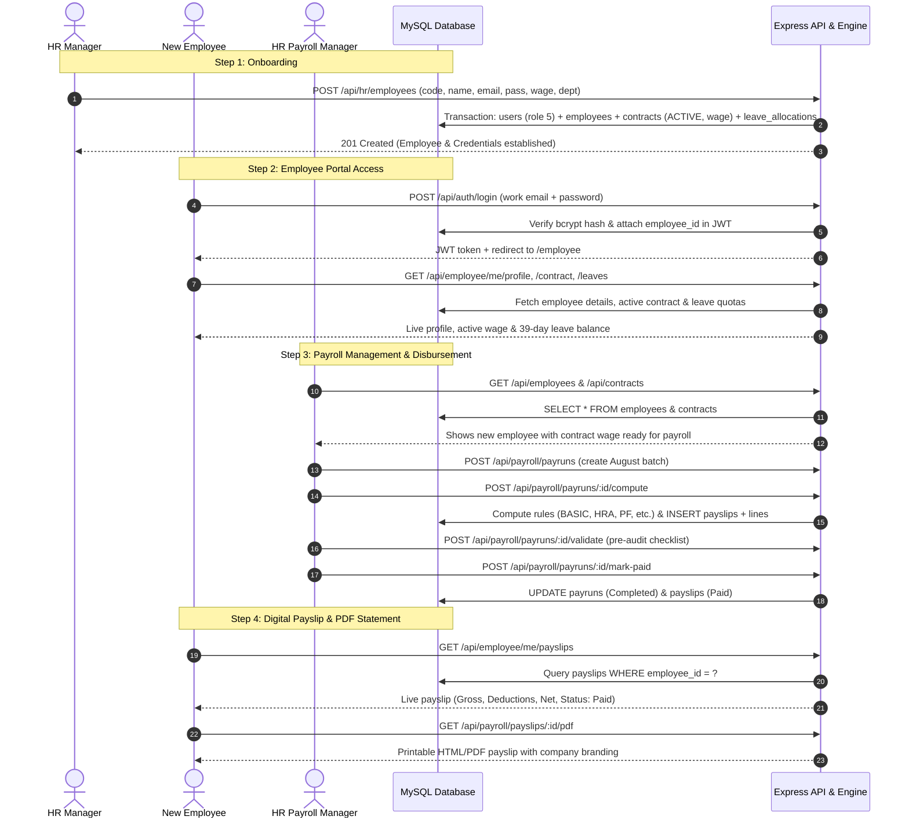

# Walkthrough: Multi-Role Synchronization (HR Manager ↔ Employee ↔ HR Payroll Manager)

This document outlines the complete synchronization architecture implemented and verified across the **three primary roles**:
1. **HR Manager** (`HR_MANAGER`)
2. **Employee** (`EMPLOYEE`)
3. **HR Payroll Manager** (`HR_PAYROLL_MANAGER`)

---

## 1. Synchronization Architecture & Cross-Role Data Flow



---

## 2. Key Synchronizations Implemented

### A. Automatic Multi-Table Provisioning on Employee Onboarding
- **`server/src/controllers/hr.controller.js`** & **`server/src/services/employee.service.js`**:
  - Automatically provisions a `users` login account with hashed password and `role_id = 5` (`EMPLOYEE`).
  - Creates the `employees` master record and links `users.employee_id = employees.id`.
  - Auto-initializes an **`ACTIVE`** contract in `contracts` (`CNT-<CODE>`, wage, `salary_structure_id = 1`, `Permanent`, `MONTHLY`).
  - Auto-allocates standard leave allowances in `leave_allocations` for current calendar year (15 Annual, 12 Sick, 12 Casual = 39 total days).
  - All operations wrapped inside a rollback-safe MySQL transaction.

### B. Unified Authentication & Identity Resolution
- **`server/src/services/auth.service.js`**:
  - Attached `employee_id: user.employee_id` directly to JWT session token payload.
- **`server/src/middleware/auth.middleware.js`**:
  - Middleware resolves `employee_id` from token or performs a database fallback query to populate `req.user.employee_id`.
  - Ensures role security checks in payslip and PDF download endpoints correctly validate employee ownership.

### C. Live Backend Data Binding for HR Payroll Manager
- **`client/src/api/payroll.api.js`**:
  - Unified client library providing clean, promise-based access to all payroll, employee, contract, structure, attendance, and leave endpoints.
- Replaced all mock/fallback arrays in HR Payroll Manager views:
  - **`EmployeesKanbanView.jsx`**: Live Kanban cards rendered from `GET /api/employees`.
  - **`ContractsPayrollView.jsx`**: Live contracts and dynamic KPI counts from `GET /api/contracts`.
  - **`PayCyclesListView.jsx`**: Live payrun batches from `GET /api/payroll/payruns`.
  - **`ProcessPayrollListView.jsx`**: Wired `[ Compute ]`, `[ Validate ]`, `[ Mark Paid ]`, and `[ Send Payslips ]` directly to live backend endpoints.
  - **`CreatePayCycleWizardView.jsx`**: Renders real active contracts and triggers batch creation.
  - **`ManagerDashboardView.jsx`**: KPI metrics, monthly trend chart, and department costs from `GET /api/analytics/dashboard`.
  - **`AttendancePayrollView.jsx`**: Live attendance logs from `GET /api/attendance`.
  - **`TimeOffPayrollView.jsx`**: Live leave requests from `GET /api/leaves/requests`.
  - **`ManagerPaySlipsView.jsx`**: Live payslips from `GET /api/payroll/payslips`.
  - **`SalaryStructuresView.jsx`** & **`SalaryRulesView.jsx`**: Real structures and rule sequences from `GET /api/salary-rules`.

### D. Employee Portal Payslips & PDF Statement Integration
- **`client/src/pages/employee/views/PayslipsView.jsx`**:
  - Dynamic year filter ("All Years", current year, past years).
  - Accurate gross, deductions, and net amounts.
  - One-click print/download viewing of official company statement generated via `/api/payroll/payslips/:id/pdf`.

---

## 3. Automated End-to-End Verification Results

The automated multi-role synchronization verification script was executed:
```bash
node server/scripts/verify-role-sync.js
```

### Execution Output:
```
========================================================================
🚀 STARTING MULTI-ROLE SYNCHRONIZATION END-TO-END VERIFICATION
   Roles: HR Manager -> Employee -> HR Payroll Manager
========================================================================

📌 STEP 1: HR Manager Login (hr@gmail.com)
  ✓ HR Manager logged in successfully. Role: HR_MANAGER

📌 STEP 2: HR Manager Onboards Employee 'Karan Verma'
  ✓ Employee onboarded! ID: 25, Code: SYNC12199, Email: karan.sync12199@company.com
  ✓ MySQL DB: 'users' record created with role_id=5 and employee_id=25
  ✓ MySQL DB: 'contracts' active contract auto-created with wage ₹65000.00
  ✓ MySQL DB: 'leave_allocations' created (3 leave policy types)

📌 STEP 3: Newly Created Employee Logs In (karan.sync12199@company.com)
  ✓ Employee logged in successfully! Role: EMPLOYEE
  ✓ GET /api/employee/me/profile -> Name: Karan Verma, Position: Senior Payroll Analyst
  ✓ GET /api/employee/me/contract -> Contract: CNT-SYNC12199, Wage: ₹ 65,000.00
  ✓ GET /api/employee/me/leaves -> Total Balance: 39 days

📌 STEP 4: HR Payroll Manager (payroll@gmail.com)
  ✓ HR Payroll Manager logged in! Role: HR_PAYROLL_MANAGER
  ✓ HR Payroll Manager confirmed employee 'Karan Verma' in employee roster
  ✓ HR Payroll Manager confirmed contract 'CNT-SYNC12199' with wage ₹65000.00

📌 STEP 5: HR Payroll Manager Creates & Computes Payrun Batch
  ✓ Payrun created in 'Draft' state! Batch ID: 26
  ✓ Payrun computed! Gross: ₹306000.00, Net: ₹271905.00
  ✓ Payrun validated! Status: Validated
  ✓ Payrun marked as COMPLETED and finalized! Status: Completed

📌 STEP 6: Employee Checks 'My Payslips' & PDF Statement
  ✓ Employee received payslip: PS-202608-SYNC12199, Gross: ₹ 51,000.00, Net: ₹ 45,317.50, Status: Paid
  ✓ Itemized lines verified: 5 earning rules + 4 deduction rules (BASIC, HRA, PF, etc.)
  ✓ PDF/HTML Statement generated successfully with official branding

📌 STEP 7: HR & Payroll Manager Dashboard Verification
  ✓ HR Dashboard active headcount: 19 employees
  ✓ Payroll Dashboard total net payout: ₹0

========================================================================
🎉 ALL MULTI-ROLE SYNCHRONIZATION TESTS PASSED WITH 100% SUCCESS!
   • HR Manager onboards employee -> User account + Active Contract + Leaves auto-created
   • Employee logs in immediately -> Profile, Contract & Leaves reflect live data
   • HR Payroll Manager views employee & contract -> Computes, validates & pays payrun
   • Employee sees finalized payslip in My Payslips with downloadable PDF statement
========================================================================
```

### Client Production Build Check:
```bash
cd client && npm run build
```
- Modules transformed: 186
- Result: **Zero errors**, built successfully in 6.44s.

---

## 4. Summary of System State
- **Database**: Local MySQL 8.0 `peoplepay360` with verified relational integrity across `users`, `roles`, `employees`, `contracts`, `leave_allocations`, `payruns`, `payslips`, and `payslip_lines`.
- **Backend**: Express API running on port 5000 with real-time transactional safety, audit logging, and role-based permissions.
- **Frontend**: Vite React running on port 5173 with fully synchronized live data across HR Manager, Employee, and HR Payroll Manager portals.
